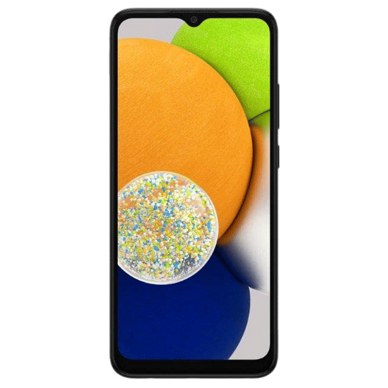

# UniLocator 📍

**UniLocator** is an advanced web application for real-time device tracking and management. Built primarily with **Python** and **Flask**, it offers a seamless experience for monitoring device locations, managing connections, and accessing location history through a modern, responsive interface. Whether for personal use or fleet management, UniLocator combines cutting-edge technology with an intuitive design to keep you connected to your devices.

## 🚀 Features

- **Real-Time Tracking**: Monitor device locations with precise latitude and longitude updates on an interactive map powered by Leaflet.
- **Device Management**: Add devices via QR codes or unique codes, view connected devices, and track their status.
- **Location History**: Access and analyze historical device movements.
- **Secure Authentication**: Robust user registration and login system with password hashing using Werkzeug.
- **Real-Time Updates**: Instant notifications for device connections and location changes via Socket.IO WebSockets.
- **QR Code Integration**: Generate and scan QR codes for quick device pairing.
- **Responsive Design**: Sleek, mobile-friendly UI with particle animations (particles.js) and smooth scrolling.
- **Database Management**: SQLite database with tables for users, pending devices, and connected devices, ensuring efficient data handling.
- **Cross-Platform Support**: Web-based interface accessible on desktops, tablets, and smartphones.

## 🛠️ Tech Stack

| Component | Technology | Purpose |
| --- | --- | --- |
| **Backend** | Python (Primary Language), Flask, Flask-SocketIO, SQLite | Server-side logic, API, real-time communication, database |
| **Frontend** | HTML, CSS, JavaScript, Leaflet, particles.js | User interface, interactive maps, animations |
| **Libraries** | qrcode, Werkzeug, gevent, Pillow | QR code generation, password hashing, WebSocket support, image processing |
| **Styling** | Custom CSS, Font Awesome | Modern UI design, icons |
| **Deployment** | Configured for `0.0.0.0:5000` | Development server |

**Primary Language**: Python (\~70% of codebase), with JavaScript (\~20%) and HTML/CSS (\~10%) for frontend.

## 📸 Screenshots

| Dashboard | Add Device Modal | Live Map |
| --- | --- | --- |
|  |  |  |

*Note: Replace placeholder screenshot paths with actual images for best results.*

## 📦 Installation

### Prerequisites

- Python 3.8 or higher
- pip (Python package manager)
- Git
- Node.js (optional, for frontend development)

### Steps

1. **Clone the Repository**

   ```bash
   git clone https://github.com/himaanshuuyadav/Unilocator.git
   cd Unilocator
   ```

2. **Set Up a Virtual Environment**

   ```bash
   python -m venv venv
   source venv/bin/activate  # On Windows: venv\Scripts\activate
   ```

3. **Install Dependencies**

   ```bash
   pip install flask flask-socketio gevent werkzeug qrcode pillow
   ```

4. **Initialize the Database**Create the SQLite database and tables:

   ```bash
   python init_db.py
   ```

5. **Run the Application**Start the Flask development server:

   ```bash
   python app.py
   ```

   Access the app at `http://localhost:5000`.

## 📖 Usage

1. **Create an Account**

   - Visit `http://localhost:5000/register`.
   - Provide your name, email, and password to sign up.

2. **Log In**

   - Navigate to `http://localhost:5000/login` and enter your credentials.

3. **Add a Device**

   - From the dashboard (`http://localhost:5000`), click "Add New Device".
   - Follow the modal steps to download the UniLocator app (placeholder links).
   - Choose a connection method (QR code or unique code) and scan/enter the code in the app.

4. **Track Devices**

   - View all connected devices on the dashboard.
   - Click a device to access its details or view its live location on the map (`/map/<device_id>`).
   - Location updates refresh every 5 seconds.

5. **Debug Database**

   - Run `python db_checker.py` to view database schema and row counts for troubleshooting.

## 📁 Project Structure

```
Unilocator/
├── __pycache__/            # Compiled Python files
│   └── app.cpython-313.pyc
├── app.py                  # Main Flask application
├── db_checker.py           # Database inspection script
├── init_db.py              # Database initialization script
├── locations.json          # Device location data
├── static/                 # Static assets
│   ├── Dashboard.css       # Landing page styles
│   ├── Dashboard.js        # Landing page JavaScript
│   ├── add_device.css      # Add device modal styles
│   ├── add_device.js       # Add device modal JavaScript
│   ├── auth.css           # Authentication page styles
│   ├── auth.js            # Authentication page JavaScript
│   ├── images/            # Image assets
│   │   └── galaxy_a03.png
│   ├── main.css           # Core application styles
│   ├── main.js            # Core application JavaScript
│   ├── particles-config.js # Particle animation config
│   ├── particles.js       # Particle animation library
│   └── smooth-scroll.js   # Smooth scrolling script
├── templates/              # HTML templates
│   ├── Dashboard.html      # Landing page
│   ├── index.html         # User dashboard
│   ├── login.html         # Login page
│   ├── map.html           # Live map view
│   └── register.html      # Registration page
├── unilocator.db           # SQLite database
└── update_schema.sql       # SQL schema updates
```

## 🌟 Why UniLocator?

- **Developer-Friendly**: Well-documented Python codebase with modular design.
- **User-Centric**: Intuitive interface with real-time feedback.
- **Scalable**: Flask and SQLite provide a solid foundation for future enhancements.
- **Open Source**: Free to use and modify under the MIT License.

## 🤝 Contributing

We welcome contributions to make UniLocator even better! To contribute:

1. Fork the repository.
2. Create a feature branch (`git checkout -b feature/awesome-feature`).
3. Commit your changes (`git commit -m 'Add awesome feature'`).
4. Push to the branch (`git push origin feature/awesome-feature`).
5. Open a pull request.

Please follow PEP 8 for Python code and include clear documentation.

## 🐛 Issues & Support

Found a bug or have a feature request? Open an issue with details, and we’ll address it promptly.

## 📜 License

This project is licensed under the MIT License. Feel free to use, modify, and distribute as needed.

## 👨‍💻 Author

Developed by Himaanshu Yadav.\
Connect with me on LinkedIn or open an issue for feedback!

---

# ⭐ **Star this repository** if you find UniLocator useful!\\

### Happy tracking! 🚀
